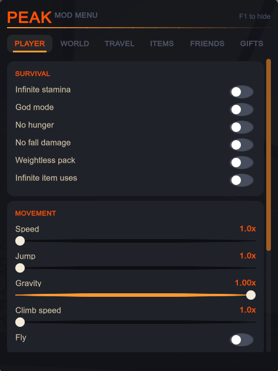
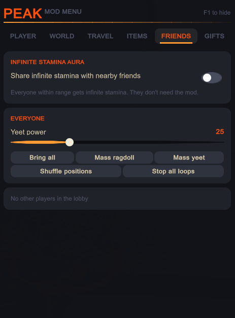
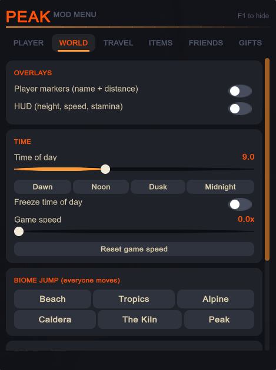
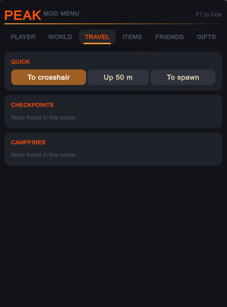
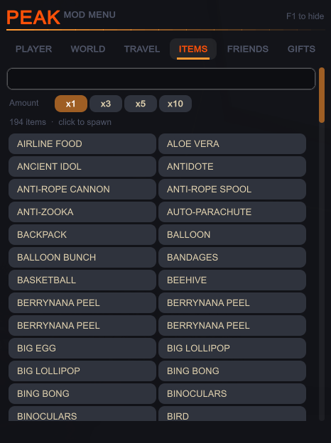

<div align="center">

# PEAK Mod Menu

**An in-game mod menu for [PEAK](https://store.steampowered.com/app/3527290/PEAK/).**
Cheats, teleports, an item spawner, and a pile of ways to mess with your friends. Press **F1** and go.


-1b2838?style=flat-square)


[](LICENSE)

<br>

 &nbsp; 

</div>

---

## Quick start

```powershell
winget install Microsoft.DotNet.SDK.8     # once, if you don't have the .NET SDK
git clone <this-repo-url>
cd <repo-folder>
powershell -ExecutionPolicy Bypass -File .\install.ps1
```

Then launch PEAK from Steam, load into a level, and press **F1**.

The installer finds your game, builds the mod against your own game files, and copies three files into the game folder. Details and troubleshooting are [below](#install).

---

## What's in the menu

The menu has six tabs and a draggable, fading window with its own dark theme.

<table>
  <tr>
    <td align="center" width="33%"><br><b>Player</b></td>
    <td align="center" width="33%"><br><b>World</b></td>
    <td align="center" width="33%"><br><b>Travel</b></td>
  </tr>
  <tr>
    <td align="center" width="33%"><br><b>Items</b></td>
    <td align="center" width="33%"><br><b>Friends</b></td>
    <td align="center" width="33%"><br><b>Gifts</b><br><sub>shown once friends are in your lobby</sub></td>
  </tr>
</table>

### Player
- **Survival:** infinite stamina, god mode, no hunger, no fall damage, weightless pack, infinite item uses
- **Movement:** speed, jump, gravity and climb-speed sliders, plus fly (`WASD`, `Space` up, `Ctrl` down)
- **Fun:** ragdoll, launch up or forward, super jump, skeleton toggle, random look
- **Actions:** full stamina, clear status effects, revive

### World
- **Overlays:** player markers (name and distance) and a HUD with height, speed and stamina
- **Time:** time of day with dawn, noon, dusk and midnight presets, freeze time, game speed slider
- **Biome jump:** Beach through Peak (host only)
- **Scoutmaster:** sic it on yourself or call it off
- **Run and profile:** force win, unlock all ascents, unlock all cosmetics

### Travel
Teleport to your crosshair, to spawn, up 50 m, or to any checkpoint or campfire in the level.

### Items
All 190+ items by their real in-game names, with search and an amount picker (x1, x3, x5, x10).

### Friends
- **Infinite stamina aura:** everyone within range gets infinite stamina. Your friends don't need the mod.
- **Per friend:** go to, bring, swap, ragdoll, yeet, call the Scoutmaster, skeleton on/off, revive
- **Loops:** "keep ragdolled" and "pogo" (auto-yeet)
- **Everyone at once:** bring all, mass ragdoll, mass yeet, shuffle everyone's positions

### Gifts
Feed any item to a friend (its effect runs on them) or put it in their hands. The menu scans the game's items at startup and builds one-click presets for whatever effects exist: infinite stamina, invincibility and speed on the buff side; chaos, blind, random warp, launch and more on the troll side. Items that can kill are blocked from "Use it on them".

---

## Install

### Requirements

- Windows 10 or 11
- PEAK installed through Steam
- [.NET SDK 8](https://dotnet.microsoft.com/download/dotnet/8.0) (`winget install Microsoft.DotNet.SDK.8`)
- PowerShell (included with Windows)

### Steps

1. **Close PEAK** if it's running.
2. Clone this repo and open PowerShell inside it.
3. Run the installer:
   ```powershell
   powershell -ExecutionPolicy Bypass -File .\install.ps1
   ```
   It finds your PEAK folder (see [How PEAK is found](#how-peak-is-found)), builds `Doorstop.dll`, downloads [Unity Doorstop](https://github.com/NeighTools/UnityDoorstop) 4.5.0 from its official release, and copies `winhttp.dll`, `doorstop_config.ini` and `Doorstop.dll` into the game folder.

   If PEAK isn't found automatically, pass the folder (Steam: right-click PEAK, Manage, Browse local files):
   ```powershell
   powershell -ExecutionPolicy Bypass -File .\install.ps1 -PeakDir "D:\Games\Steam\steamapps\common\PEAK"
   ```
4. Launch PEAK, load into a level, and press **F1**.

### How PEAK is found

You normally don't need to tell the scripts where the game is. They look, in order:

1. **Steam's own records.** Steam's install folder from the Windows registry, and every library folder listed in Steam's `libraryfolders.vdf`. That covers libraries on any drive, whatever the folder is called.
2. **A scan of every drive** (fixed and removable) for `steamapps\common\PEAK`, in the drive root and up to two folders down (for example `E:\Games\SteamLibrary`).

A folder only counts if it contains `PEAK.exe`. If more than one install is found, the installer lists them and uses the first; pass `-PeakDir` to pick another. If nothing is found, it tells you to pass `-PeakDir` yourself.

### Uninstall

```powershell
powershell -ExecutionPolicy Bypass -File .\uninstall.ps1
```

This deletes the three files above (and `PeakMenu.log` if present). Steam's "Verify integrity of game files" also works.

### After a PEAK update

The mod is compiled against the game's own code. If an update renames something it uses, the menu may stop working or fail to build. Re-run `install.ps1` to rebuild against the new version.

---

## Troubleshooting

| Problem | What to check |
|---|---|
| F1 does nothing | Look for `PeakMenu.log` in the game folder. It should read `Entrypoint.Start reached`, `Assembly-CSharp loaded`, `First scene loaded: ...`, `Menu created`. If the file is missing, the loader isn't running: make sure `winhttp.dll` and `doorstop_config.ini` sit next to `PEAK.exe`. |
| Game won't start, or a white screen | Run `uninstall.ps1` to confirm the game works without the mod, then re-run `install.ps1`. If you ask for help, include `PeakMenu.log` and the game's `Player.log` (`%USERPROFILE%\AppData\LocalLow\LandCrab\PEAK\Player.log`). |
| `install.ps1` can't find PEAK | It checks Steam's libraries and scans every drive (see above). If your game is somewhere unusual, pass `-PeakDir` as shown above. |
| It found PEAK but says `Assembly-CSharp.dll` is missing | The game install looks incomplete. In Steam, right-click PEAK, Properties, Installed Files, Verify integrity of game files. |
| `.NET SDK not found` | `winget install Microsoft.DotNet.SDK.8`, then open a new PowerShell window. |
| A friend feature does nothing | Some effects depend on how the game syncs state between players and have had light testing. Self-only features work in any lobby. Biome jump needs you to be the host. |

---

## How it works

- `Doorstop.dll` is this mod. Unity Doorstop calls `Doorstop.Entrypoint.Start()` very early, before Unity has registered its native functions, so the entry point only subscribes to an assembly-load event and then a scene-load event, and creates the menu object on the first scene load.
- The UI is IMGUI with generated rounded textures. No external assets.
- Friend effects use the game's own RPCs (`WarpPlayerRPC`, `RPCA_Fall`, `RPCA_AddForceAtPosition`, `GetFedItemRPC`, ...) and its own "radiate infinite stamina" affliction.

### Project layout

```
install.ps1 / uninstall.ps1   one-step install and removal
find-peak.ps1                 locates your PEAK install (used by both scripts)
docs/screenshots/             images used in this README
PeakMenu/
  PeakMenu.csproj             builds Doorstop.dll against your local game files
  Entry.cs                    Doorstop entry point
  Menu.cs                     window, styles, player / world / travel / items tabs
  MenuFriends.cs              friends and gifts tabs
```

---

## Author

Made by **[miehlaviscool-glitch](https://github.com/miehlaviscool-glitch)**.

Issues and pull requests are welcome.

## License

Released under the [MIT License](LICENSE). Copyright (c) 2026 miehlaviscool-glitch.

### Credits

- [Unity Doorstop](https://github.com/NeighTools/UnityDoorstop) by NeighTools loads the mod. It is **not** included in this repo; `install.ps1` downloads it from its official release, and it has its own license (LGPL-2.1).
- PEAK is made by Landfall and Aggro Crab. This project is unofficial and not affiliated with them.

## Disclaimer

This is an unofficial fan-made project. It contains no game files; the build reads them from your own install. Use it in single-player or with friends who are up for it. Online cheating can get you in trouble with other players, and you use this at your own risk.
